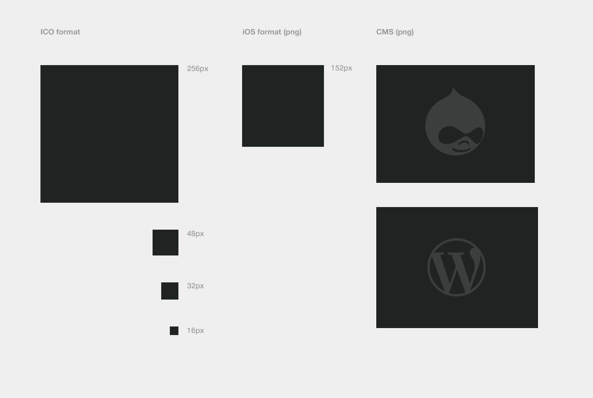

##Touch, CMS & favicon

PSD template for creating the many icons needed for the websites we build. Including CMS theme settings page.

### Code that get's placed in the `<head>`

_favicon:_

    <link type="image/x-icon" rel="Shortcut Icon" href="/favicon.ico">

_Touch icons in head:_

    <link rel="apple-touch-icon-precomposed" sizes="144x144" href="/images/touch/apple-touch-icon-144x144-precomposed.png">
    <link rel="apple-touch-icon-precomposed" sizes="114x114" href="/images/touch/apple-touch-icon-114x114-precomposed.png">
    <link rel="apple-touch-icon-precomposed" sizes="72x72" href="/images/touch/apple-touch-icon-72x72-precomposed.png">
    <link rel="apple-touch-icon-precomposed" sizes="57x57" href="/images/touch/apple-touch-icon-57x57-precomposed.png">
    <link rel="apple-touch-icon-precomposed" href="/images/touch/apple-touch-icon.png">

_Tile icon for Win8 (144x144 + tile color):_

    <meta name="msapplication-TileImage" content="/img/touch/apple-touch-icon-144x144-precomposed.png">
    <meta name="msapplication-TileColor" content="#333">

---

#### Exporting png's to favicon

To export the png's (48px, 32px & 16px) to ICO format, I use a great little app called [Icon Slate](http://www.kodlian.com/apps/icon-slate)

